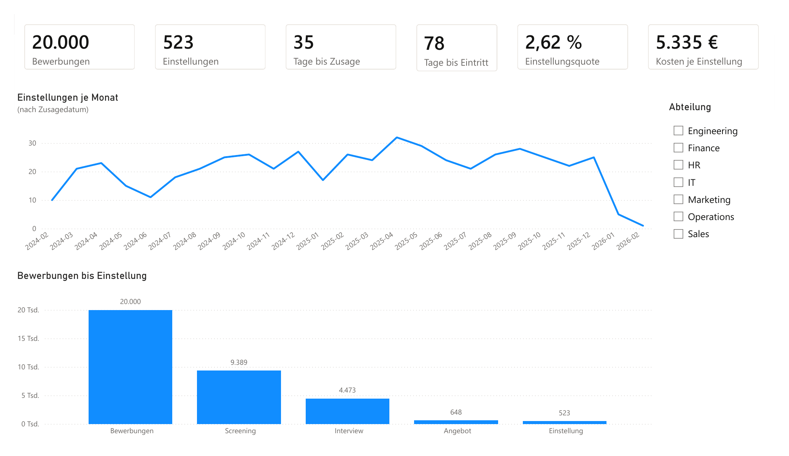
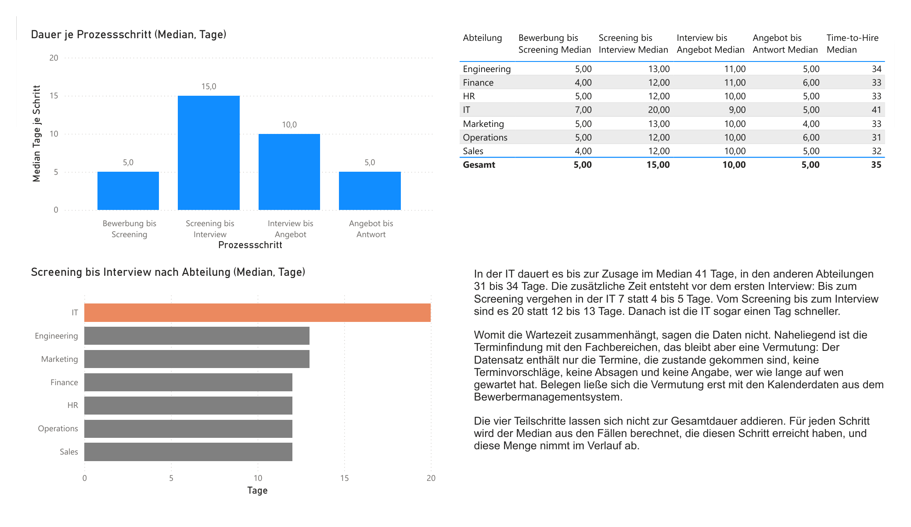
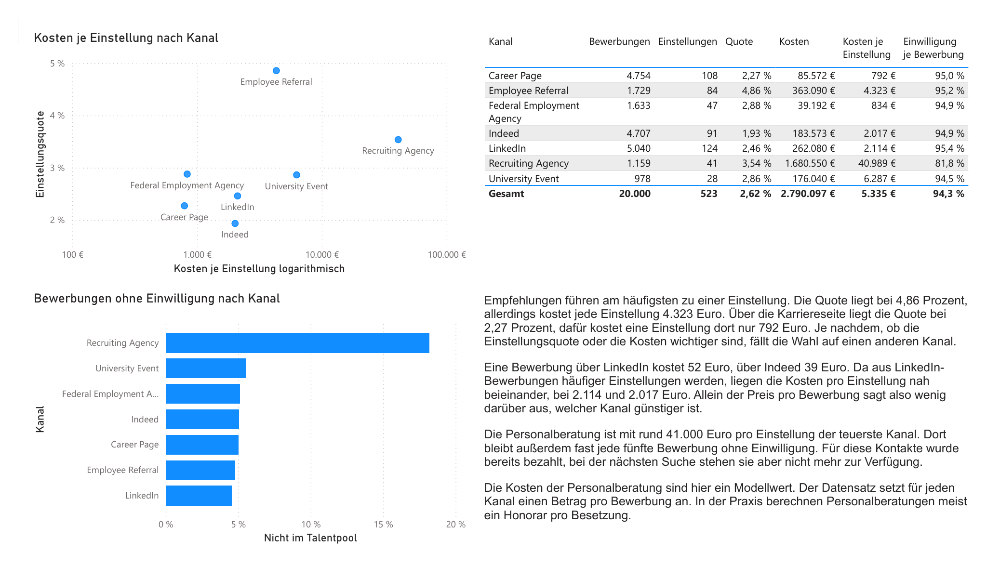
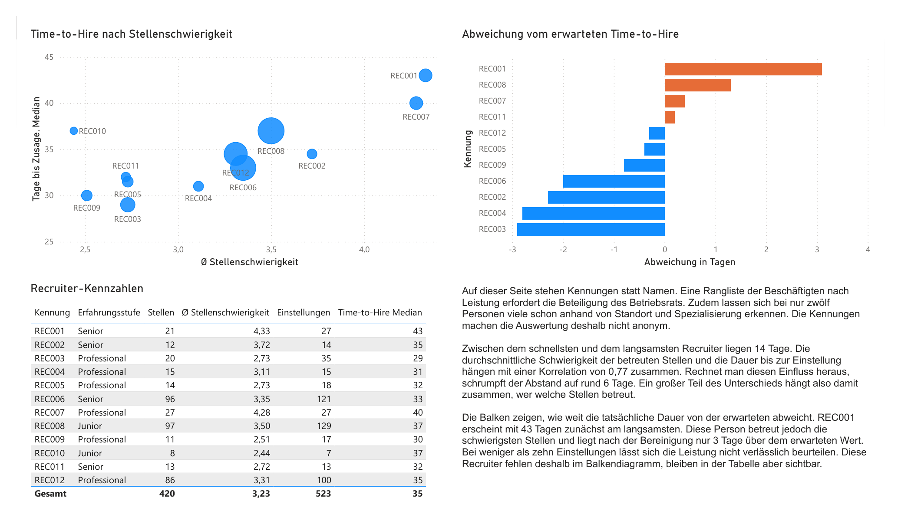

# Recruiting Analytics

Ein Bewerbungsprozess von der Rohdatei bis zum Bericht: Bereinigung in Python, Auswertung in PostgreSQL, Darstellung in Power BI. Grundlage sind 20.000 Bewerbungen aus 24 Monaten.



## Fragen

1. Wo verliert der Prozess die meisten Bewerber?
2. Woher kommt die Dauer bis zur Einstellung?
3. Welcher Kanal lohnt sich, gemessen an Quote und Kosten?
4. Unterscheiden sich die Einstellungsquoten zwischen Altersgruppen?

## Aufbau

```
data/raw              unveränderte Quelldateien
clean_data.py         Bereinigung nach data/processed, Protokoll nach docs/
load_to_postgres.py   lädt per COPY in die Datenbank
data/sql/01           Schema recruiting: Tabellen, Schlüssel, Prüfregeln
data/sql/02-06, 08    Auswertungen
data/sql/07           Schema bi: Sternschema für Power BI
powerbi/              Bericht, PDF-Export, Seitenbilder
```

Zwei Schemata, damit Quelle und Darstellung getrennt bleiben. `recruiting` hält die Daten so, wie sie geliefert wurden, nur bereinigt und mit Schlüsseln versehen. `bi` enthält die Dimensions- und Faktentabellen für den Bericht. Power BI liest ausschließlich `bi`, eine Änderung an der Darstellung lässt die Quelle also unberührt.

Die Rohdateien werden nie überschrieben. Jede Änderung steht mit Zeilenzahl und Begründung in [docs/cleaning_log.md](docs/cleaning_log.md). Der Bericht liegt zusätzlich als [PDF](powerbi/talentflow_dashboard.pdf) bei.

## Daten

Synthetischer Datensatz namens TalentFlow, keine realen Personen. Bewerbungen vom 04.01.2024 bis 31.12.2025, Zusagen bis 13.02.2026.

| Tabelle | Zeilen | Inhalt |
| --- | ---: | --- |
| applications | 20.000 | eine Zeile je Bewerbung |
| candidates | 15.000 | Bewerber, mehrere Bewerbungen möglich |
| jobs | 420 | Stellen mit Schwierigkeitsgrad |
| recruiters | 12 | zuständige Personen |
| sources | 7 | Kanäle mit Kosten je Bewerbung |
| stage_events | 55.053 | Prozessereignisse mit Datum |
| interviews | 5.016 | Termine und Bewertungen |
| offers | 648 | Angebote |

### Bereinigung

Im Rohbestand steckten 85 Dubletten, 24 Schreibweisen für 7 Kanäle, drei gemischte Datumsformate samt nicht existierender Kalendertage und 100 Ereignisse, die vor dem Vorgang lagen, zu dem sie gehören.

Entfernt wurden nur die 85 Dubletten, und auch die erst, nachdem sie als exakte Zeilenkopien nachgewiesen waren. Sonst bleibt jede Zeile stehen: Unplausible Werte gehen auf NULL und bekommen eine Prüfspalte (`has_valid_job`, `has_valid_candidate`, `salary_is_plausible`). Eine Bewerbung ohne zuordenbare Stelle zählt damit im Trichter mit und fehlt nur dort, wo die Stelle gebraucht wird. Das betrifft 10 Fälle.

## Ergebnisse

### Trichter

| Stufe | Bewerbungen | Übergang |
| --- | ---: | ---: |
| Eingegangen | 20.000 | |
| Screening | 9.389 | 46,95 % |
| Interview | 4.473 | 47,64 % |
| Angebot | 648 | 14,49 % |
| Einstellung | 523 | 80,71 % |

2,62 Prozent aller Bewerbungen führen zu einer Einstellung.

Der Engpass liegt zwischen Interview und Angebot, dort bleiben 85 Prozent liegen. Ein Teil davon ist keine Auswahlentscheidung: 285 Bewerber wurden nach dem Interview abgelehnt, weil die Stelle inzwischen besetzt war. Ohne sie steigt die Quote auf 15,47 Prozent.

### Prozessdauern



| Schritt | Median | Fälle |
| --- | ---: | ---: |
| Bewerbung bis Screening | 5 Tage | 9.359 |
| Screening bis Interview | 15 Tage | 4.456 |
| Interview bis Angebot | 10 Tage | 648 |
| Angebot bis Antwort | 5 Tage | 648 |
| **Bewerbung bis Zusage (Time-to-Hire)** | **35 Tage** | 523 |
| Zusage bis geplantem Eintritt | 43 Tage | 508 |
| **Bewerbung bis geplantem Eintritt** | **78 Tage** | 508 |

Time-to-Hire endet mit der Annahme des Angebots, das sind 35 Tage. Bis zum geplanten Arbeitsbeginn vergehen weitere 43. Wer eine Stelle plant, rechnet also mit 78 Tagen und nicht mit 35. Die unteren beiden Zeilen sind dabei weicher als die oberen: Der Datensatz kennt nur den im Angebot vereinbarten Termin, nicht den tatsächlichen Eintritt, und bei 15 der 523 Einstellungen fehlt er ganz.

Der längste Schritt im Verfahren selbst liegt zwischen Screening und erstem Interview, im Median 15 Tage. In der IT dauert die Strecke bis zur Zusage 41 Tage statt 31 bis 34, und der Abstand entsteht vor dem Interview: 7 statt 4 bis 5 Tage bis zum Screening, 20 statt 12 bis 13 bis zum Gespräch. Danach ist die IT sogar einen Tag schneller als der Rest. Woran die Wartezeit liegt, steht nicht in den Daten, Terminvorschläge und abgesagte Gespräche sind nicht erfasst.

Die Teilschritte addieren sich nicht zur Gesamtdauer. Jeder Median rechnet über die Fälle, die den Schritt erreicht haben, und diese Menge schrumpft von Stufe zu Stufe.

### Kanäle



| Kanal | Bewerbungen | Quote | € je Bewerbung | € je Einstellung | Einwilligung je Bewerbung |
| --- | ---: | ---: | ---: | ---: | ---: |
| Career Page | 4.754 | 2,27 % | 18 | 792 | 94,97 % |
| Federal Employment Agency | 1.633 | 2,88 % | 24 | 834 | 94,86 % |
| Indeed | 4.707 | 1,93 % | 39 | 2.017 | 94,92 % |
| LinkedIn | 5.040 | 2,46 % | 52 | 2.114 | 95,44 % |
| Employee Referral | 1.729 | 4,86 % | 210 | 4.323 | 95,20 % |
| University Event | 978 | 2,86 % | 180 | 6.287 | 94,48 % |
| Recruiting Agency | 1.159 | 3,54 % | 1.450 | 40.989 | 81,79 % |

Beste Quote und bester Preis liegen bei verschiedenen Kanälen. Empfehlungen führen mit 4,86 Prozent fast doppelt so oft zu einer Einstellung wie der Durchschnitt, kosten je Einstellung aber mehr als das Fünffache der Karriereseite.

Der Preis je Bewerbung führt dabei in die Irre. Indeed ist mit 39 Euro billiger als LinkedIn mit 52, aber aus LinkedIn-Bewerbungen werden häufiger Einstellungen, und je Einstellung liegen beide fast gleichauf.

Ein Nebenbefund, der im Kostenvergleich untergeht: Über die Personalberatung fehlt bei fast jeder fünften Bewerbung die Einwilligung zur weiteren Aufbewahrung, in allen anderen Kanälen sind es rund 5 Prozent. Für diese Profile wurde der höchste Preis bezahlt.

Verloren sind sie deshalb nicht alle. Die 211 Bewerbungen kommen von 210 Personen, und bei 90 von ihnen steht bei der jüngsten Bewerbung eine Zustimmung, in 83 Fällen über einen anderen Kanal. 120 fallen tatsächlich aus dem Pool.

Das zeigt zugleich, was die letzte Spalte leistet und was nicht: Sie zählt Bewerbungen, nicht Personen. Die 20.000 Bewerbungen stammen von 11.077 Menschen, und bei 764 davon widerspricht sich die Einwilligung zwischen den eigenen Bewerbungen. `bi.dim_candidate` entscheidet solche Fälle über die zuletzt abgegebene Erklärung, weil eine Einwilligung jederzeit widerrufbar ist. Auf Personenebene liegt die Quote dann bei 94,23 Prozent, praktisch gleichauf mit den 94,3 je Bewerbung.

### Recruiter



Zwischen dem schnellsten und dem langsamsten Recruiter liegen 14 Tage, 29 gegen 43 im Median. So verglichen taugt die Zahl nichts, weil die Stellen unterschiedlich schwer zu besetzen sind. Die durchschnittliche Stellenschwierigkeit korreliert mit 0,77 mit der Dauer. Misst man jeden an dem Wert, den eine Regression für seine Stellen erwarten lässt, schrumpft der Abstand auf 6 Tage.

REC001 sieht mit 43 Tagen zunächst am langsamsten aus, betreut aber die schwierigsten Stellen und liegt bereinigt 3,1 Tage über dem Erwartungswert. Wer weniger als zehn Einstellungen hat, fehlt im Diagramm. Das betrifft eine Person, mit ihr wäre die Spanne 9,5 statt 6 Tage.

### Adverse Impact nach Altersgruppe

| Altersgruppe | Bewerbungen | Einstellungen | Quote | Impact Ratio |
| --- | ---: | ---: | ---: | ---: |
| 20-29 | 3.933 | 113 | 2,87 % | 1,00 |
| 30-39 | 7.389 | 202 | 2,73 % | 0,95 |
| 40-49 | 6.750 | 168 | 2,49 % | 0,87 |
| 50+ | 1.913 | 39 | 2,04 % | 0,71 |

Die Einstellungsquote sinkt mit jeder Altersgruppe. Die Impact Ratio setzt jede Gruppe ins Verhältnis zur besten: Die Gruppe 50+ erreicht 71 Prozent der Quote der Jüngsten. Ins Screening kommt sie noch mit 86 Prozent, der Abstand besteht dort also schon und vergrößert sich danach.

Ein Chi-Quadrat-Test über die vier Gruppen ergibt 4,36, kritisch wären 7,815 (3 Freiheitsgrade, 5 Prozent). Der Unterschied ist also mit Zufall vereinbar, absolut fehlen der Gruppe 50+ elf Einstellungen gegenüber dem Erwartungswert. Der Test setzt allerdings unabhängige Fälle voraus, und die 20.000 Bewerbungen stammen von 11.077 Personen. Auf Personenebene nachgerechnet, mit einer Zeile je Bewerber, ergibt er 4,28 und damit dasselbe Ergebnis.

Eine Schwelle von 0,80 wäre hier fehl am Platz, auch wenn sie sich anbietet. Sie stammt aus der Vier-Fünftel-Regel der US-amerikanischen [Uniform Guidelines on Employee Selection Procedures](https://www.ecfr.gov/current/title-29/subtitle-B/chapter-XIV/part-1607), und die gelten für die Merkmale nach Title VII. Altersdiskriminierung nehmen sie in § 1607.2(D) ausdrücklich aus, dafür ist der ADEA zuständig. Die 0,71 sind also eine beschreibende Verhältniszahl, kein bestandener oder gerissener Test. In Deutschland nennt das [AGG](https://www.gesetze-im-internet.de/agg/__1.html) Alter in § 1 als Merkmal, legt aber ebenfalls keine Quote fest.

Ein Quotenunterschied ist ohnehin keine Benachteiligung, er kann aus dem Bewerberfeld oder aus den Anforderungsprofilen stammen. Belastbar ist nur: Ein Blick auf die Schritte zwischen Screening und Angebot lohnt sich.

## Datenschutz und Mitbestimmung

**Die Einwilligung steuert den Talentpool, nicht die Auswertung.** Bei 1.140 Bewerbungen fehlt die Zustimmung zur weiteren Aufbewahrung. Sie zählen trotzdem überall mit, denn eine Einstellungsquote, die einen Teil der Bewerbungen weglässt, ist keine. Die Einwilligung entscheidet allein darüber, wer nach Abschluss des Verfahrens im Pool bleibt. Eine frühere Fassung hatte das umgekehrt gelöst; der Filter entfernte dort vor allem abgelehnte Angebote und hob die Annahmequote von 80,7 auf 82,2 Prozent.

**Kennungen statt Namen auf der Recruiter-Seite.** Eine nach Leistung sortierte Liste von Beschäftigten ist eine technische Einrichtung nach [§ 87 Abs. 1 Nr. 6 BetrVG](https://www.gesetze-im-internet.de/betrvg/__87.html) und damit mitbestimmungspflichtig. Bei zwölf Personen schützen Kennungen ohnehin wenig, wer Standort und Spezialisierung kennt, kommt auf die Person. Pseudonym, nicht anonym.

**Kein Merkmal ohne Zweck.** Die Altersgruppe taucht nur in der Adverse-Impact-Prüfung auf, also dort, wo sie dazu dient, Benachteiligung zu erkennen. In keiner Leistungs- oder Kanalauswertung.

## Was das Projekt nicht hergibt

- Die letzte Bewerbung stammt vom 31.12.2025. Die sechs Zusagen aus Januar und Februar 2026 am rechten Rand der Monatskurve sind der auslaufende Rest der Pipeline und kein Einbruch.
- Die Kosten der Personalberatung sind ein Modellwert. Der Datensatz rechnet je Kanal einen Betrag pro Bewerbung, in der Praxis ist es ein Honorar pro Besetzung. Die 40.989 Euro sind kein Marktpreis.
- Der Zusammenhang zwischen Schwierigkeit und Dauer ist über zwölf Recruiter gerechnet, nicht über die einzelne Stelle. Was für die Gruppe gilt, muss für die einzelne Besetzung nicht gelten.
- Ob sich der Altersunterschied über Berufserfahrung, Abteilung oder Stellenniveau erklärt, ist offen.
- 182 Bewerbungen stehen auf "In process" und haben trotzdem ein `Rejected`-Ereignis. Betroffen sind alle 182 und keine mit einem anderen Status, der Widerspruch ist also systematisch angelegt. Welche Quelle recht hat, lässt sich nicht entscheiden. Die Auswertungen hier zählen Ereignisse und sind nicht berührt, eine Auswertung der offenen Pipeline über `application_status` wäre es.
- Die Daten sind synthetisch. Die Methodik ist übertragbar, die Zahlen nicht.

## Nachvollziehen

Voraussetzungen: Python 3.10 oder neuer, PostgreSQL 16 oder neuer, Power BI Desktop.

```bash
python -m venv .venv
.venv\Scripts\activate          # Windows
pip install -r requirements.txt

python clean_data.py            # data/raw -> data/processed
```

Datenbank anlegen und Schema einspielen:

```bash
createdb talentflow
psql -d talentflow -f data/sql/01_schema.sql
```

Eine `.env` im Projektverzeichnis anlegen. Sie steht in der `.gitignore` und gehört nicht ins Repository:

```
DB_HOST=localhost
DB_PORT=5432
DB_NAME=talentflow
DB_USER=postgres
DB_PASSWORD=
```

Laden und die Berichtsschicht bauen:

```bash
python load_to_postgres.py
psql -d talentflow -f data/sql/07_bi_views.sql
```

`load_to_postgres.py` prüft die Zeilenzahlen aller acht Tabellen, bevor es festschreibt, und bricht bei Abweichungen ab, ohne etwas zu ändern.

Die Dateien `02` bis `06` und `08` sind Auswertungen und laufen einzeln in beliebiger Reihenfolge. Anschließend `powerbi/talentflow_dashboard.pbix` öffnen und die Zugangsdaten hinterlegen.

## Technik

Python mit pandas für die Bereinigung. PostgreSQL für Modell und Auswertung, darin unter anderem Fensterfunktionen, `GROUPING SETS`, `PERCENTILE_CONT` und die Regressionsfunktionen `regr_slope` und `corr`. Power BI mit Sternschema, DAX-Measures und zwei nicht verbundenen Tabellen, die die Reihenfolge von Trichterstufen und Prozessschritten steuern.
